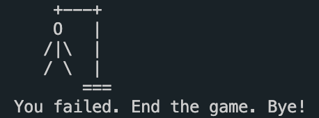

# Hangman-Minigame

### 게임설명

컴퓨터가 랜덤으로 내는 단어를 맞춰야한다. 단어마다 힌트가 주어지며, 알파벳 중 한 글자만 입력받고, 두 글자 이상 입력 시 게임을 종료시킨다.  입력한 글자가 정답 단어 안에 있을 경우 글자를 출력하고, 정답이 아닐 시 기회를 하나씩 깎는다. 

```python
while turns > 0:
    failed = 0 # 문자 매치 수

    for char in w:
        if char in guesses:
            print(char, end=' ')
        else:
            print('_', end=' ')
            failed += 1
```

총 기회 횟수는 10번이며, 기회가 깎일 때마다 '교수대-밧줄-머리-팔-손-몸통-다리-발' 순서로 그림이 출력된다.  기회가 모두 소진되면 게임오버가 되며, 실패 효과음이 나온다.
반대로 10번의 기회 안에 단어 안에 있는 글자들을 모두 유추해내면 성공!  
  

